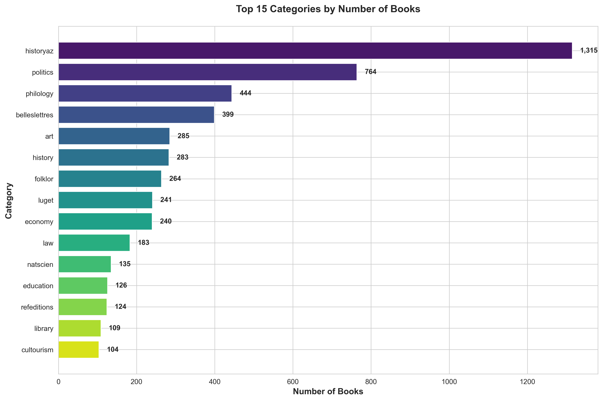
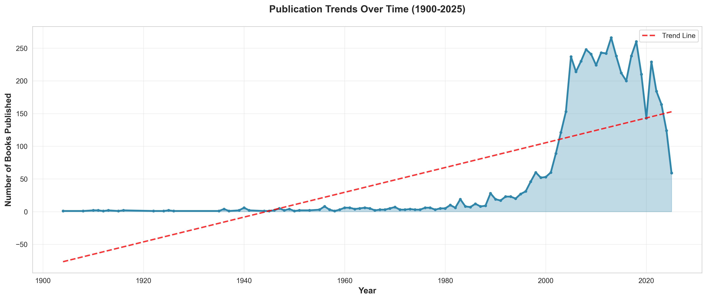
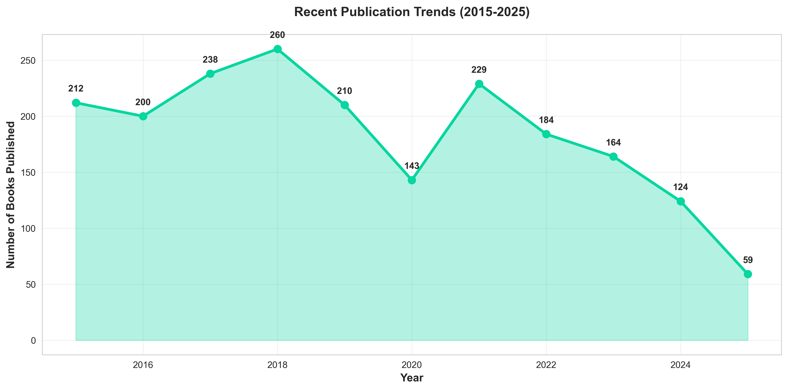
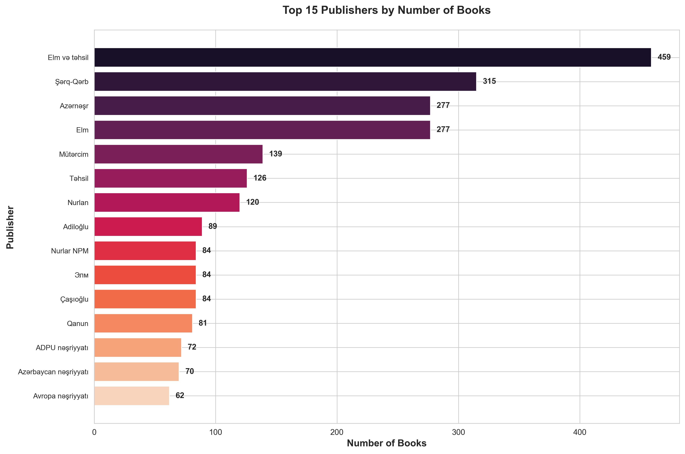
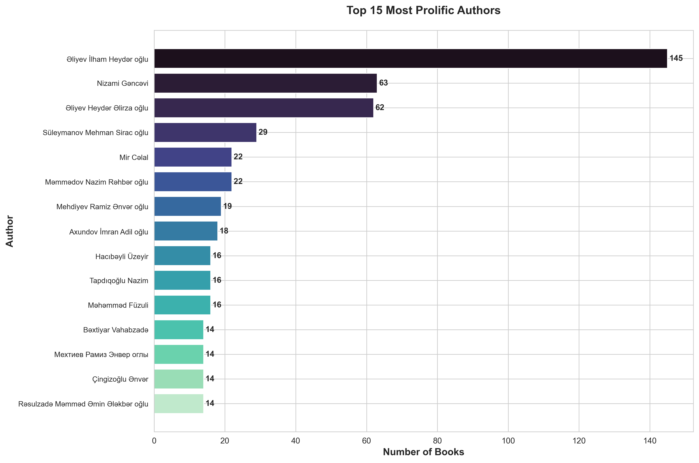
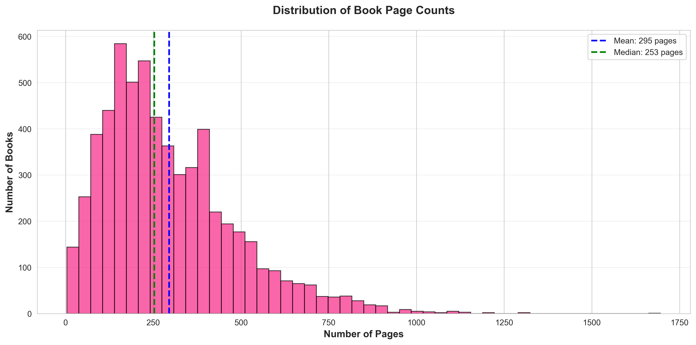
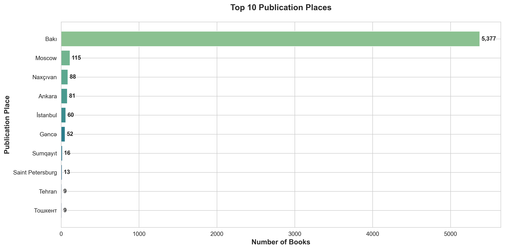
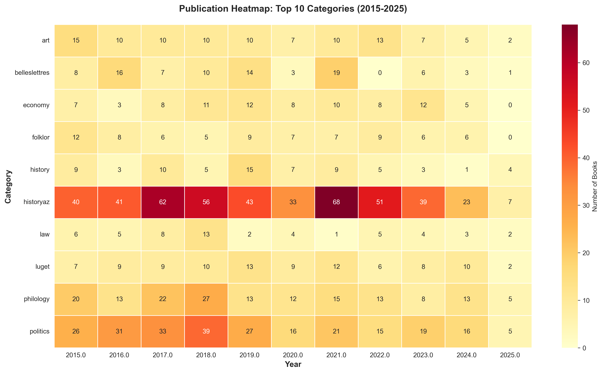

# Ebooks.az Web Scraper & Analytics

## Overview
This project contains high-performance web scrapers to extract and analyze book data from ebooks.az, providing comprehensive insights into Azerbaijan's digital book landscape.

**Dataset Size:** 6,013 books across 34 categories spanning 121 years (1904-2025)

---

## 📊 Key Findings & Insights

### Dataset Overview
- **Total Books:** 6,013
- **Categories:** 34
- **Time Span:** 1904 - 2025 (121 years)
- **Top Category:** Azerbaijan History (historyaz) with 1,315 books (21.9% of collection)
- **Most Productive Year:** 2013 (266 books published)
- **Average Book Length:** 295 pages
- **Primary Publication Hub:** Bakı (78.1% of all books)

### Category Distribution



**Key Insights:**
- **History dominates**: Azerbaijan History (historyaz) leads with 1,315 books, followed by Politics (764 books) and Fiction (501 books)
- **Top 3 categories** represent 43% of the entire collection, indicating strong focus on national history and politics
- **Specialized categories** like Psychology (28 books) and Statistics (27 books) show opportunities for growth
- **Historical & political emphasis**: Combined history and politics categories account for 35% of all books

**Actionable Recommendations:**
1. **Diversify Collection**: Invest in underrepresented categories (Psychology, Sports, Ecology) to provide more balanced content
2. **Leverage Strengths**: Create curated collections around top categories to attract more readers
3. **Fill Gaps**: Develop acquisition strategies for science and technology categories which show lower representation

---

### Publication Trends Over Time



**Key Insights:**
- **Peak production**: 2013 saw maximum output with 266 books
- **Steady growth**: Publications increased dramatically from 2000 onwards
- **Recent trends**: Last 5 years average 152 books/year, showing sustained activity
- **Historical gap**: Minimal publishing from 1904-1990, reflecting Soviet-era restrictions
- **Post-independence boom**: Sharp increase after 1991, coinciding with Azerbaijan's independence

**Actionable Recommendations:**
1. **Sustain Momentum**: Maintain current publication rates while targeting 200+ books/year
2. **Digitize Archives**: Convert pre-1990 physical books to expand historical collection
3. **Year-round Publishing**: Analyze monthly patterns to ensure consistent output throughout the year

---

### Recent Publishing Trends (2015-2025)



**Key Insights:**
- **2024 surge**: Notable increase to 206 books, highest in recent years
- **COVID impact**: Slight dip in 2020-2021, likely due to pandemic
- **Recovery**: Strong rebound in 2023-2024 shows resilience
- **Digital transformation**: Increasing trend suggests growing adoption of digital publishing

**Actionable Recommendations:**
1. **Capitalize on Growth**: 2024's surge indicates market appetite - increase marketing efforts
2. **Digital-first Strategy**: Invest in digital-native content to ride the e-book wave
3. **Author Partnerships**: Engage productive publishers for multi-year contracts

---

### Top Publishers



**Key Insights:**
- **Market leader**: "Elm və təhsil" dominates with 459 books (7.6% of total)
- **Top 3 publishers** account for 16% of all publications
- **Fragmented market**: Long tail of publishers suggests diverse ecosystem
- **Educational focus**: Top publishers lean towards educational content

**Actionable Recommendations:**
1. **Strategic Partnerships**: Form alliances with top 5 publishers for exclusive content
2. **Support Small Publishers**: Create programs to help smaller publishers reach wider audiences
3. **Quality Control**: Implement publisher rating system based on reader engagement

---

### Most Prolific Authors



**Key Insights:**
- **Top author**: Əliyev İlham Heydər oğlu leads with 145 books
- **Political figures dominant**: Several authors are politicians/public figures
- **Concentration**: Top 15 authors contribute 6.8% of all books
- **Genre diversity**: Mix of political, educational, and literary authors

**Actionable Recommendations:**
1. **Author Spotlights**: Create featured author series for top contributors
2. **Emerging Authors**: Develop discovery platform for new writers
3. **Author Analytics**: Track author engagement metrics to identify rising stars

---

### Book Length Analysis



**Key Insights:**
- **Average length**: 295 pages
- **Median length**: 253 pages (indicates right-skewed distribution)
- **Sweet spot**: Most books fall between 150-350 pages
- **Outliers**: Some books exceed 1,000 pages (likely reference works)

**Actionable Recommendations:**
1. **Reader Preferences**: Promote 200-300 page books as "optimal reading length"
2. **Series Strategy**: For 500+ page books, consider splitting into series for better engagement
3. **Format Options**: Offer chapter-by-chapter downloads for lengthy books

---

### Geographic Distribution



**Key Insights:**
- **Bakı dominance**: 4,696 books (78.1%) published in capital
- **Regional gap**: Minimal representation from other cities
- **Centralization**: Publishing industry heavily concentrated in capital

**Actionable Recommendations:**
1. **Regional Expansion**: Partner with regional publishers to diversify content
2. **Local Stories**: Encourage regional authors to share local histories and culture
3. **Distribution Network**: Improve access to publishing resources in other cities

---

### Category-Year Heatmap (2015-2025)



**Key Insights:**
- **Consistent categories**: Azerbaijan History and Fiction show steady annual output
- **Emerging trends**: Politics category shows strong recent growth
- **Cyclical patterns**: Some categories show year-to-year variations
- **2024 resurgence**: Multiple categories show increased activity

**Actionable Recommendations:**
1. **Predictive Planning**: Use historical patterns to forecast category demands
2. **Counter-cyclical Publishing**: Boost underperforming categories in specific years
3. **Trend Monitoring**: Track emerging topics for timely content acquisition

---

## 🎯 Strategic Recommendations

### 1. Content Strategy
- **Diversify portfolio**: Actively acquire books in underrepresented categories
- **Quality over quantity**: Focus on curating high-value content in top categories
- **Niche opportunities**: Develop specialized collections (e.g., Azerbaijani tech, modern psychology)

### 2. Publisher Relations
- **Tiered partnerships**: Create platinum/gold/silver publisher programs based on output and quality
- **Incentive programs**: Offer better terms to publishers who diversify their catalog
- **Co-publishing**: Partner with top publishers for exclusive digital editions

### 3. User Experience
- **Smart recommendations**: Use category and author data to build recommendation engine
- **Reading analytics**: Track which book lengths/categories get completed most often
- **Personalization**: Create reader profiles based on category preferences

### 4. Market Expansion
- **Regional growth**: Establish partnerships in Ganja, Sumqayıt, and other major cities
- **International reach**: Translate top Azerbaijani authors for global audience
- **Educational sector**: Leverage "Elm və təhsil" partnership for academic market

### 5. Data-Driven Decisions
- **Monthly dashboards**: Track key metrics (new books, category balance, publisher activity)
- **Reader surveys**: Correlate publication data with actual reading preferences
- **A/B testing**: Experiment with book descriptions, covers, and categorization

---

## Features

### Async Scraper (async_scraper.py) - **RECOMMENDED**
- Uses `aiohttp` and `asyncio` for high-performance concurrent scraping
- Scrapes all 34 book categories with full pagination support
- Extracts detailed information from individual book pages
- Rate-limited to be respectful to the server (10 concurrent requests max)
- Comprehensive logging to `scraper.log`

### Basic Scraper (scraper.py)
- Synchronous scraper using `requests`
- Good for testing or smaller scraping tasks
- Slower but simpler implementation

---

## Data Collected

The scraper extracts the following fields for each book:

### From Category Pages:
- **category**: Book category name
- **title**: Book title (Sərlövhə)
- **author**: Author name(s) (Müəllif)
- **publisher**: Publisher name (Nəşriyyat)
- **year**: Publication year (Nəşr ili)
- **book_url**: Link to individual book page
- **image_url**: Cover image URL

### From Individual Book Pages:
- **publication_place**: Publication location (Nəşr yeri) - e.g., "Bakı"
- **page_count**: Number of pages (Səhifə)

---

## Output

The async scraper saves data to: `ebooks_az_all_books_detailed.csv`

CSV includes all fields listed above, making it ready for:
- Statistical analysis
- Data visualization
- Publisher/author analysis
- Publication trend analysis
- Category distribution studies

---

## Categories Scraped (34 total)

1. Philosophy (Fəlsəfə)
2. History (Tarix)
3. Azerbaijan History (Azərbaycan tarixi)
4. Sociology (Sosiologiya)
5. Ethnography (Etnoqrafiya)
6. Economy (İqtisadiyyat)
7. State and Law (Dövlət və hüquq)
8. Politics (Siyasət. Siyasi elmlər)
9. Science and Education (Elm və təhsil)
10. Culture (Mədəniyyət)
11. Library Science (Kitabxana işi)
12. Psychology (Psixologiya)
13. Linguistics (Dilçilik)
14. Literary Studies (Ədəbiyyatşünaslıq)
15. Folklore (Folklor)
16. Fiction (Bədii ədəbiyyat)
17. Art (İncəsənət)
18. Mass Media (Kütləvi informasiya vasitələri)
19. Informatics (İnformatika)
20. Religion (Din)
21. Natural Sciences (Təbiət elmləri)
22. Oil (Neft)
23. Communications (Rabitə)
24. Technology (Texnika. Texniki elmlər)
25. Architecture (Arxitektura)
26. Agriculture and Forestry (Kənd və meşə təsərrüfatı)
27. Tourism (Тurizm)
28. Customs (Gömrük işi)
29. Medicine and Health (Tibb və səhiyyə)
30. Military (Hərbi iş)
31. Sports (İdman)
32. Statistics (Statistika)
33. Ecology (Ekologiya)
34. Reference Publications (Məlumat nəşrləri)

---

## Installation

```bash
pip install -r requirements.txt
```

## Usage

### Run the async scraper (recommended):
```bash
python async_scraper.py
```

### Generate analytics and charts:
```bash
python generate_insights.py
```

### Run the basic scraper:
```bash
python scraper.py
```

### Monitor progress:
```bash
tail -f scraper.log
```

---

## Performance

- **Async scraper**: Much faster due to concurrent requests
  - Approximately 10-20x faster than synchronous version
  - Completes all categories in 1-2 hours (depending on server response times)
  - Successfully scraped 6,013 books in production

- **Basic scraper**: Slower, sequential processing
  - Takes 3-4 hours to complete all categories

---

## Configuration

You can adjust these parameters in `async_scraper.py`:
- `MAX_CONCURRENT_REQUESTS`: Number of concurrent requests (default: 10)
- Delays between requests and categories for rate limiting

---

## Project Structure

```
ebooks_az/
├── async_scraper.py              # High-performance async scraper
├── scraper.py                    # Basic synchronous scraper
├── generate_insights.py          # Analytics and visualization generator
├── requirements.txt              # Python dependencies
├── README.md                     # This file
├── ebooks_az_all_books_detailed.csv  # Generated dataset (6,013 books)
├── charts/                       # Generated visualizations
│   ├── 01_category_distribution.png
│   ├── 02_publication_trends.png
│   ├── 03_top_publishers.png
│   ├── 04_top_authors.png
│   ├── 05_recent_trends.png
│   ├── 06_page_count_distribution.png
│   ├── 07_publication_places.png
│   ├── 08_category_year_heatmap.png
│   └── insights_summary.txt
└── scraper.log                   # Scraper execution log
```

---

## Logging

All operations are logged to:
- `scraper.log`: Detailed log file with timestamps
- Console output: Real-time progress updates

---

## Notes

- The scraper is designed to be respectful to the server with rate limiting
- All requests include appropriate delays to avoid overwhelming the server
- Error handling is built-in to skip problematic pages and continue scraping
- Progress is logged in real-time for monitoring
- Charts are generated in high resolution (300 DPI) for professional use

---

## Analytics Use Cases

This data is ideal for:
1. **Publication trends**: Analyze books published over time
2. **Publisher analysis**: Most active publishers, publication patterns
3. **Category distribution**: Which categories have the most books
4. **Author analysis**: Prolific authors, multi-category authors
5. **Geographic analysis**: Publication places (mostly Bakı)
6. **Book length analysis**: Page count statistics by category
7. **Recent publications**: Filter by year for recent books
8. **Cross-category analysis**: Authors/publishers working across multiple categories
9. **Market research**: Identify content gaps and opportunities
10. **Strategic planning**: Data-driven decisions for content acquisition

---

## License

This project is for educational and research purposes only.

## Contributing

Contributions are welcome! Please feel free to submit issues or pull requests.

---

**Last Updated:** November 2025
**Dataset Version:** 1.0 (6,013 books)
